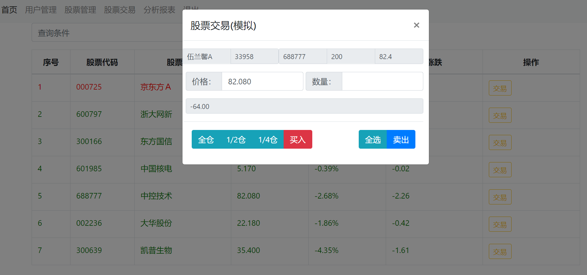

# Python学习案例--股票模拟交易系统
作者：海盐老伍，  wujize188@163.com

###主要技术，
后台：Flask框架，sqlalchemy, blueprint,定时任务,MYSQL
前台：Bootstrap，ajax,jquery, echart
数据爬取：request,BeautifulSoup,selenium
###主要功能：本项目是一个简单的股票模拟交易管理系统，包括用户管理，股票管理，交易管理等以及帐户信息，用以作面掌握python基于flask的实际项目案例编程。

## 一、数据模型设计
users: 用户表，记录用户登录帐号。初始化时建立一个admin用户，初始密码为123456.新户新建时缺省密码为password
accounts: 用户的资金帐户信息，包括银行卡信息，帐户余额，当前一个用户一个帐户 
stocks: 股票信息，股票公司的基础信息
account_stocks：用户帐户下的股票余额信息，由交易事务自动生成，保留股票数据，成本，收益，
trades：股票交易历史台帐记录

数据ORM采用Flask-SQLAlchemy，分页采用SQLAlchemy的分页功能。
模型文件为models.py，模型语言件有一个AlchemyEncoder类，用于日期、时间、decimal类的json格式系列化修正。
database.py用于初始化数据库，执行时会清空数据库已存在的数据

为了便于后面统计程序开发，设计了一个视图文件，用于统计，视图创建代码如下：
```angular2html
create definer = root@`%` view account_stat as
select `stock`.`account_stocks`.`stock_code`                                                                      AS `stock_code`,
       `stock`.`accounts`.`account`                                                                               AS `account`,
       `stock`.`account_stocks`.`cost`                                                                            AS `cost`,
       `stock`.`account_stocks`.`number`                                                                          AS `number`,
       `stock`.`stocks`.`current_price`                                                                           AS `current_price`,
       `stock`.`stocks`.`stock_name`                                                                              AS `stock_name`,
       `stock`.`accounts`.`account_name`                                                                          AS `account_name`,
       `stock`.`accounts`.`accu_earning`                                                                          AS `accu_earning`,
       (`stock`.`account_stocks`.`number` *
        (`stock`.`stocks`.`current_price` - `stock`.`account_stocks`.`cost`))                                     AS `stock_earning`
from ((`stock`.`account_stocks` left join `stock`.`stocks` on ((`stock`.`account_stocks`.`stock_code` = `stock`.`stocks`.`stock_code`)))
         left join `stock`.`accounts` on ((`stock`.`account_stocks`.`account` = `stock`.`accounts`.`account`)));
```

## 二、框架
本学习案例采用的是Flask基础框架，以前后端开发为主，后端用Flask产生应用接口服务，前后端数据用json格式进行传递。
前端用bootstrap框架编程，用ajax对数据进行异步调用，用modal框进行同页面多功能复用。
前后端部分消息传递采用了flask的jinja2的flash功。

前端功能采用jquery实现。

本项目股票基本信息采用selenium获取，BeautifulSoup进行解析，用re正则式进行内容匹配获取，功能在get_stock.py中实现。
股票行情信息采用urllib库的request采集

用户密码采用md5加密保存。

## 三、模块功能
### 3.1 首页
index.html首页功能使用时，系统后台要先检查用户是否便当，登录后显示首页信息，首页显示用户信息，用户帐户信息用户股票信息，以及用户收益。
用户开通帐户后才能交易，帐户开通时，帐户虚拟充入10万元，用于模拟交易用。

### 3.2 用户登录
login.html用户登录，输入用户名和口令，提交后台认证。

### 3.2 用户管理
user.html 用户管理功能，包括用户添加、删除、修改，系统初始化建的admin不允许删除和修改。
密码初始化，修改用户的密码。
用户有帐户信息将不允许删除，但可以冻结。凝结用户不能再登录。
除admin用户外，管理员组用户可以管理用户。

### 3.3 股票信息管理
stock.html用于添加、修改、删除股票信息，添加与修改股票信息时，输入股票代码后可以从后台获取股票的基本信息，减少输入工作。

### 3.4 交易管理
trade.html用于从后台获取股票行情信息，行情每分钟自动刷新一次，以支持进行股票买卖交易，后台更新用户帐户表。

### 3.5 统计报表功能
统计用户收益情况，集成百度Echart图形进行展示

调用新浪接口，生成大盘行情图。


